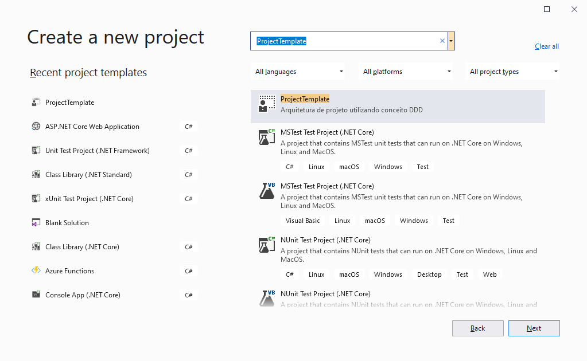

# Template de Projeto DDD

Fala pessoal, tudo certo ?

Criei esse template com o desenvolvimento de Arquitetura utilizando "_Conceito DDD_" e alguns outros Designer Patterns.

Abaixo os designer pattners e alguns links para estudo.

# Designer Patterns e Conceitos (Links)
1. Inversão de Controle (IoC) - [O padrão de inversão de controle](https://imasters.com.br/dotnet/o-padrao-de-inversao-de-controle-ioc)

2. Injeção de Dependencia (DI) - [Design Patterns - Injeção de Dependência com C#](https://www.devmedia.com.br/design-patterns-injecao-de-dependencia-com-csharp/23671)

3. Repository Pattern - [Entendendo o Repository Pattern](https://medium.com/@renicius.pagotto/entendendo-o-repository-pattern-fcdd0c36b63b)

4. Notification Pattern - [Não Lance Exceptions em seu Domínio... Use Notifications!](https://medium.com/tableless/n%C3%A3o-lance-exceptions-em-seu-dom%C3%ADnio-use-notifications-70b31f7148d3)

5. Value Objects - [Value Objects: Uma Técnica Para Código Auto-Documentado E Menos Erros](https://carlosschults.net/pt/value-objects-ferramenta/)

# Como utilizo esse template ?

Copie o arquivo _Template.zip_ que esta dentro da pasta _Template_ para a pasta "C:/Users/USER/Documents\Visual Studio 2019\Templates\ProjectTemplates\Visual C#"... Simples assim...

Após colar o .zip na pasta é só abrir o Visual Studio 2019 e pedir para criar um novo projeto. Segue imagem abaixo

# Entendendo as Camadas

### **1.Application**

Apresentação do projeto, no caso estou utilizando ASP.NET API, mas poderia ser ASP.NET MVC por exemplo.
Esta camada é responsavel por ser a porta de entrada das suas requisições.

### **2.Domain**

Nesta camada é onde se concentra/define toda sua regra de negocio, por exemplo, é nela onde voce fala que um "Pedido" tem varios "Itens do Pedido". A camada de dominio é a base para o conceito DDD (Domain Driven Design).

Aqui também definimos as interfaces dos Repositorios, definidindo assim quais regras para acessar a base de dados, por exemplo, "Buscar Cliente por ID"(GetCustomerByID), e por ai vai... já vi também alguns casos que as interfaces de Serviço são definidas aqui, mas eu prefiro deixar separado em outra camada, apenas por organização.

### **3.InfraEstructure**

A camada de Infraestrutura eu separo em outras duas camadas, no template esta separado em _CrossCutting_ e _Data_.

- **CrossCutting**

    Aqui é onde eu implemento a injeção de Dependencia dos repositorios, Services e também do Contexto utilizado, nesse template, esta comentado as linhas para utilizar banco de dados Sql Server como contexto.

    Existem alguns exemplos onde a camada de CrossCutting, é local para incluir regra de segurança da aplicação, Cache entre outros... eu prefiro deixar isso para a camada Shared para deixar a camada de Application com menos responsabilidades possiveis.

- **Data**

    Tem como responsabilidade a implementação do Contexto utilizado, por exemplo, se voce utiliza Entity Framework, é nesta camada onde seria implementado o _Unit of Work_, onde seria implementado os DbSet e toda configuração o EF.

    Aqui também é onde implementamos as interfaces do Repositorio, que foram definidas lá na camada de _Domain_.

A Infraestrutura é o lugar onde realmente trabalhamos com o banco de dados escolhido, se caso for necessario a sua aplicação alterar a base de dados utilizada. Daqui começa os trabalhos kkk

### **3.Services**

A responsabilidade da camada de Services é 'traduzir' as requisições da Api para os Repositorios, por exemplo, mapear uma DTO (Data Transfer Object) para uma entidade e assim executar um insert pelo Repositorio. Eu tenho costume de separar em dois projetos, _Interfaces_ e _Services_.

- **Interface**

    É aqui onde implemento as DTO's, interfaces dos Services e implementação do AutoMapper. Nesse template eu coloquei apenas um exemplo do Mapper de _Customer_ para _CustomerDTO_.

- **Services**

    Implementação das interfaces dos Services, a responsabilidade do Services é realizar as validações necessarias para que a request que chegou da API por exemplo, chegue na camada de _InfraEstructure.Data_ já consolidada para executar na base.

### **4.Shared**

A _Shared_ é onde eu impleto toda os metodos compartilhados (ah vá...) com as outras camadas do projeto, por exemplo, nesse template eu implementei  a classe abstrata do _Value Objects_, mas poderia ter colocado também os metodos de Extensão.

### **5.Tests**
Aqui é onde voce garante que sua aplicação funcione sem precisar ficar testando ela utilizando o navegador, no futuro quero deixar alguns exemplo de testes unitario aqui.

